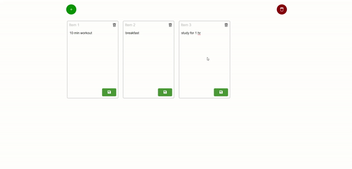

# TO DO List 

This project is a to do list . you can add and remove items 
The app saves the list on the cookies .




### Live URL

[Check it here](https://minaibrahimsaid.github.io/crazy-to-do-list/)


## Run Locally

Clone the project

```bash
  git clone https://github.com/minaibrahimsaid/crazy-to-do-list.git
```

Go to the project directory

```bash
  cd crazy-to-do-list
```

Install dependencies

```bash
  npm i
```

Start the server

```bash
  npm start
```


## Deployment

Go to the project directory

```bash
  cd crazy-to-do-list
```
To deploy this project run

```bash
  npm run deploy
```


## Lessons Learned

Nothing new 

## Tech Stack

**Client:** React


